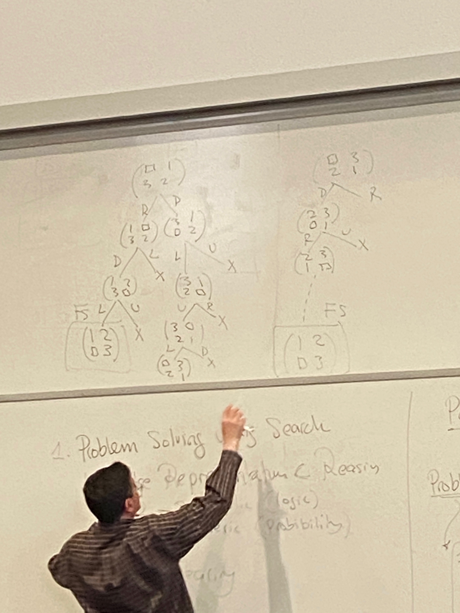

# Lecture 12

## Modeling, Reasoning, and Learning under Uncertainty
- "classical" logic is monotonic
- If $\Delta \models \alpha$ then $\Delta \wedge \beta \models \alpha$
  - if $M(D)\subseteq M(\alpha)$
  - $M(D\wedge\beta) \subseteq M(\alpha)$
  - LHS equal to $M(D) \cap M(\beta)$
- e.g.
  - Tweety is a bird -> Tweety can fly
  - Tweety is a penguin -> Tweety cannot fly
- $\forall x \; Bird(x) \implies flies(x)$
- goal:
  - good $\Delta \wedge Bird(Tweety) \models flies(Tweety)$
  - bad $\Delta \wedge Bird(Tweety) \wedge \neg flies(Tweety)$ "contradiction"
- $\forall x \; Bird(x) \wedge \neg ab(x) \implies flies(x)$
  - good $\Delta \wedge Bird(Tweety) \wedge \neg flies(Tweety)$ "no contradiction"
  - $\Delta \wedge Bird(Tweety) \models flies(Tweety)$
- $\Delta \wedge assumptions \models flies(Tweety)$
  - non-monotonic
  - default

## Example
- $\forall x \; Quaker(x) \wedge \neg ab_1(x) \implies Pacifist(x)$
- $\forall x \; Republican(x) \wedge \neg ab_2(x) \implies \neg Pacifist(x)$
- Quaker(Nixon)
- Republican(Nixon)
- contradiction?

## Degree of Belief
- [0, 1]
- probabilities

## State of Belief
|  | E Earthquake      | B Burglary | A Alarm | Pr(.) |
| - | ----------- | ----------- | -| -|
| $w_1$      | T       | T | T | 0.0190
| $w_2$      | T       | T | F | 0.0010
| $w_3$      | T       | F | T | 0.0560
| $w_4$      | T       | F | F | 0.0240
| $w_5$      | F       | T | T | 0.1620
| $w_6$      | F       | T | F | 0.018
| $w_7$      | F       | F | T | 0.0072
| $w_8$      | F       | F | F | 0.7128
| | | | | 1

##
- $Bel(\alpha) = \sum_{w \models \alpha} Bel(w)$
- $Pr(\alpha) = \sum_{w\models \alpha}p_i(w)$
- $Pr(E) = 0.1$
- $Pr(\neg B) = 0.8$
- $Pr(B \vee \neg E) = 0.92$
  - $w_1, w_2, w_5, w_6, w_7, w_8$
- $Pr(A) = 0.2442$
- for any sentence $\alpha$
  - $0 \leq p_i(\alpha) \leq 1$
- $\alpha$ is inconsistent; $Pr(\alpha) = 0$
- $\alpha$ is valid; $Pr(\alpha) = 1$
- $Pr(\alpha) + Pr(\neg \alpha) = 1$
- $Pr(\alpha \vee \beta) = Pr(\alpha) + Pr(\beta)$ if $\alpha, \beta$ are mutually exclusive
  - $M(\alpha) \cap M(\beta) = \empty$
- $Pr(\alpha \vee \beta) = Pr(\alpha) + Pr(\beta) - Pr(\alpha \wedge \beta)$

## Terms
- "Evidence": additional information
- $\beta$
- Initial state of belief: $Pr(.)$
- Updated state of belief given evidence $\beta$: $Pr(. | \beta)$

## Evidence:
- Alarm triggered (A)
  - everything with A F turns to 0
  - divide the rest of the probabilities by Pr(A)
- Thus,
$$\begin{equation}
Pr(w|\beta)=
    \begin{cases}
        Pr(w)/Pr(\beta) & \text{if } w \models \beta\\
        0 & \text{if } w \models \neg \beta
    \end{cases}
\end{equation}$$
- Closed form:
  - $Pr(\alpha | \beta) = \frac{Pr(\alpha \wedge \beta)}{Pr(\beta)}$
  - also read as probability of alpha given beta - Bayes conditioning

## Belief Change
- $Pr(B) = 0.20$
- $Pr(B|A) = 0.741$
- $Pr(E) = 0.1$
- $Pr(E|A) = 0.307$
- $Pr(B|A, E) = 0.253$
- $Pr(B|A, \neg E) = 0.957$
- $Pr(B) = 0.20$
- $Pr(B | E) = 0.20$
- $Pr(E) = 0.10$
- $Pr(E | B) = 0.10$

## Independence
- If $Pr(\alpha | \beta) = Pr(\alpha)$
  - $\alpha$ is independent of $\beta$
- implies $Pr(\beta | \alpha) = Pr(\beta)$
- "$\alpha, \beta$ are independent"
- $Pr(\alpha \wedge \beta) = Pr(\alpha) Pr(\beta)$
- $\alpha, \beta$ are independent given $\gamma$
  - $Pr(\alpha | \beta, \gamma) = Pr(\alpha | \gamma)$

