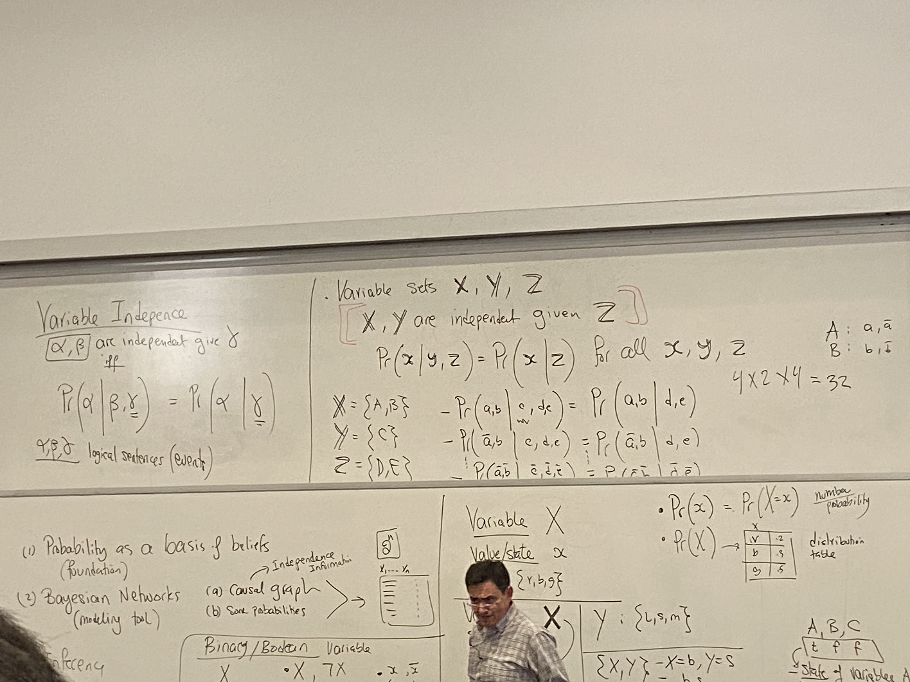

# Lecture 13

## Bayesian
- Probability as a basis of beliefs (foundation)
- Bayesian Networks (modeling networks)
  - causal graph
  - some probabilities
  - compact representation, synthesize an exponentially sized table
- Inference
- Learning

## Notation
- Variable X
- value/state x
- Pr(x) = Pr(X=x)
  - this is a number/probability
- Pr(X)
  - distribution table
- Variable <b>X</b>
  - set of variables
  - bold means set
- state of variables A, B, C
  - instatiation
  - <b>x</b>
- Binary/Boolean variable
  - $x$ vs $\bar{x}$
  - $x$ vs $\neg x$

## Causal Graph
- Capturing independence graphically
- DAG- directed acyclic graph
- parents
  - list
- descendants
  - list
- nondescendants
  - exclude node and its parents

## Markovian Assumptions
- I(v, Parents(v), Non-Descendants(v))
  - given parents, v is independent from the nondescendants
- e.g.
  - I(C, A, BER)
  - I(R, E, ABC)
  - I(A, BE, R)
  - I(B, $\empty$, RE)
  - I(E, $\empty$, B)

## D-separation
- check all paths between X and Y; if each such path is blocked by Z, then dsep(X, Z, Y)