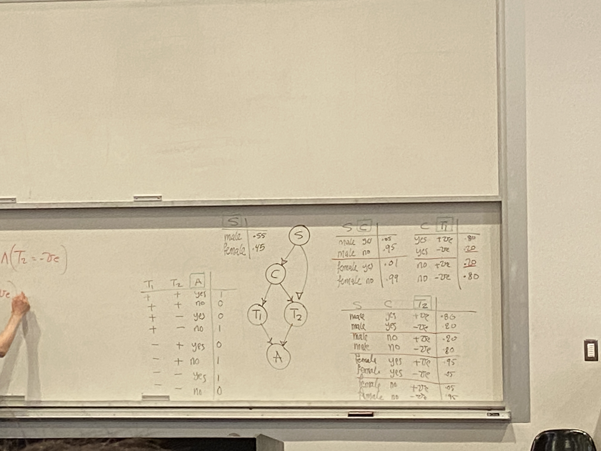

# Lecture 14

## Inference
- queries
- algorithms
  - core complexity result
  - sketch state of the art class of algorithms

## Modeling
- 2-3 scenarios
  - sensitivity analysis

- prior marginals
- posterior marginals
- MPE: most probable explanation
- MAP: maximum a posteriori hypothesis

- SDP: same decision probability
- causal queries:
  - intercentral queries
  - counterfactual queries

## Trees and polytrees
- polytrees: nodes can have multiple parents