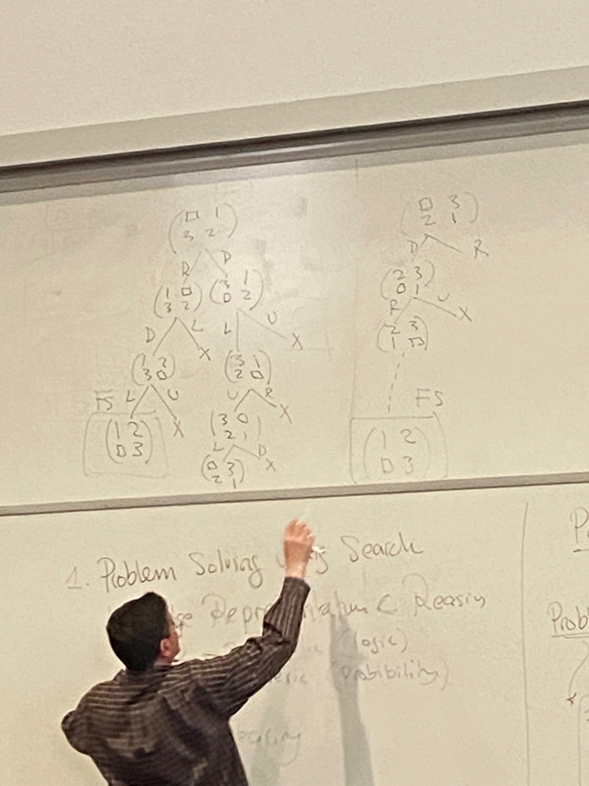

# Lecture 2

## Problem Solving using Search
- Knowledge Representation & Reasoning
  - symbolic (logic)
  - numeric (probability)
- Machine Learning

## Problem Solving using Search Parts
- Problem
  - search fomulation
  - define in terms of 3 ingredients
    1. initial state
    2. Final/Goal state
    3. actions/transitions
- Search Engine
  - pass problem to, get solution automatically
- Search strategy
  - blind/uninformed - can do jobs using just 1, 2, and 3
  - heuristic/informed - more potent, needs \
    4. heuristic
- Constraint Satisfaction Problem (CSP)
- Two-player games

## 8-puzzle/sliding tile puzzle
- 3x3 array of tiles, 1 missing tile, numebrs 1-8
- want to do end with:

| 1 | 2 | 3 |
| - | - | - |
| 8 |   | 4 |
| 7 | 6 | 5 | 

- start e.g.

| 7 | 6 | 1 |
| - | - | - |
| 4 | 5 |   |
| 8 | 3 | 2 | 

- only up to 4 possible moves at any time- think of moving the blank tile instead of moving a number

## Search Tree
- initial state:

| 5 | 4 |   |
| - | - | - |
| 6 | 1 | 8 |
| 7 | 3 | 2 | 

- create a tree with U, D, L, R as possible children (but not necessarily all 4)
- repeated state (omit)
- could be infinite

## 3-puzzle:
|   | 1 | 
| - | - |
| 3 | 2 |

R:
| 1 |   | 
| - | - |
| 3 | 2 |

D: 
| 3 | 1 | 
| - | - |
|   | 2 |
etc.

- cost 3, cost 9
- optimal search strategy
  - cost of solution
  - cost of finding a solution
- action: deterministic action
- state -> (action) state

## River & boat
- boat can take at most 2
- cannot have more o than x at any point, on either side of river
- boat cannot travel empty
- all Os on one side of the river is ok
- represent state using: a, b, c
  - number of x at boat location
  - number of o at boat location
  - boat location - true, false

## Complexity
- number of states (state space)
- branching factor (max number of children for a node)

## Constraint Satisfaction
- 8 queens problem
- none of them attack the other
- no queens in same row, same column, same diagonal
- state is list of queen locations, from 0 to 8
  - initial state is blank
- action is put a queen on the board
- no final state, but instead final state test
- finite depth search tree - 8
- no optimal/non optimal solution