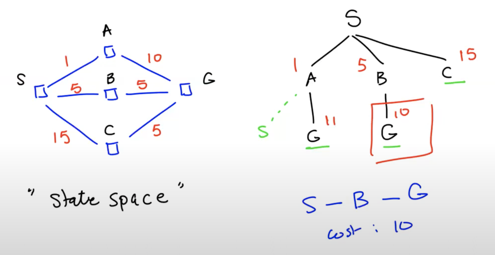
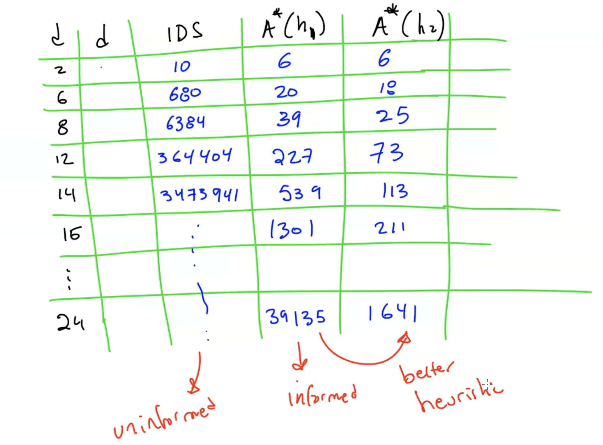

# Lecture 4

# Parts of search
- Search Problem
  - IS
  - FS
  - Succ fn
  - (heuristic)
- Search Engine
- Search strategy
  - blind/uninformed
  - heuristic/informed

## Types of Search
- Uniform-cost search
- Greedy (best-first-search)

## For later lectures
- CSP: Constraint Satisfaction Problems
- 2-player games

## Uniform-Cost Search (UCS)
- generalizes breadth-first search
  - allow arbitrary costs for actions > 0
- "state space"
- Expand node
  - check if goal
  - if not, generate children
- may lose optimality if check for goal when generating instead of expanding

## Evaluating UCS
- complete? yes
- optimal? yes
- Exponential time and space:
  - Suppose $\epsilon$:smallest cost of any action
  - if the optimal solution has cost $c*$
  - then I may have to go down to depth $\lceil c*/\epsilon \rceil$
- time complexity
  - $b^{\lceil c*/\epsilon \rceil}$
- space complexity
  - $b^{\lceil c*/\epsilon \rceil}$

## Heuristics
- using a tree, g(A) = least cost distance to A from root
- "straight-line distance"
  - h(n)
  - can create a table, take the least straight-line distance
  - called "greedy best-first search", not necessarily optimal

## A* search
- a combination of the two
- use g(n) + h(n)
- when expanding, not when generating
- evaluation function f(n) = g(n) + h(n)
  - g(n): cost so far to reach n
  - h(n): estimated cost to goal from n
  - f(n): estimated total cost of a path that goes through n
- heuristic is "admissible"
  - h(n) <= h*(n)
    - where h* is the least cost to go from n to goal
    - h(n) >= 0
    - h(0) = 0 for a goal G
  - A* with an admissible heuristic (h(n)) is optimal
  - proof

## Heuristic h(n)
- for the 8 game: two heuristics (admissible)
  - h1: how many of the squares are misplaced
  - h2: sum of manhattan distances of the misplaced squares (the distance between the square and where it should be)
  - if h2(n) >= h1(n) for all n, h2 dominates h1
  - we want higher, leads to much better performance

- What if both are admissible but neither dominates the other?
  - take the max of the two
- use heuristic of constant 0?
  - degenerates to UCS