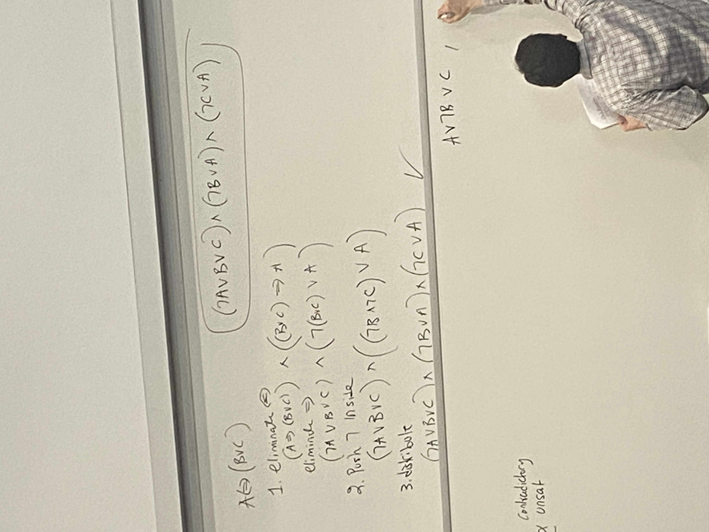

# Lecture 9

## Inference Methods
1. Truth tables (enumerating models)
2. inference rules: resolution (on CNF)
   - $\Delta \models \alpha$
3. by conversion to SAT
4. by conversion to "tradable forms" (knowledge compilation)

## Converting sentences into CNF
- (1) get rid of all connectives but $\vee$, $\wedge$, $\neg$
  - $\alpha \implies \beta \rightarrow \neg \alpha \vee \beta$
  - $\alpha \iff \beta \rightarrow (\alpha \implies \beta) \wedge (\beta \implies \alpha)$
- (2) Use de Morgan's law to push negations inside:
  - $\neg (\alpha \wedge \beta) \rightarrow \neg \alpha \vee \neg \beta$
  - $\neg (\alpha \vee \beta) \rightarrow \neg \alpha \wedge \neg \beta$
- (3) distribute $\vee$ over $\wedge$
  - $(\alpha \wedge \beta) \vee \gamma \rightarrow (\alpha \vee \beta) \wedge (\beta \vee \gamma)$

## Resolution
- $$\frac{A \vee \neg B \vee C, B \vee D \vee F}{A \vee C \vee D \vee F}$$

## Unit Resolution
- $$\frac{\neg A \vee \neg B \vee C, \neg C}{\neg A \vee \neg B}$$
- not refutation complete

## Conversion to SAT
- $\Delta \models \alpha$ iff $\Delta \wedge \neg \alpha$ unsat
- $\Delta$ is equivalent to $\alpha$
  - $\Delta \models \alpha$ and $\alpha \models \Delta$
- $\Delta$ is valid
  - $\neg \Delta$ is unsat

## DFS (backtracking) search
- for solving SAT is known as DPLL
  - A, B, C
  - if A 0, B 1, $\neg A, B$
- can make unit resolution resolution complete by adding clauses

## Local Search
- CNF $\alpha_1, \cdots, \alpha_n$
- variables $A, B, C, D$
- w: A T, B F, C F, D, T, $w \models \Delta$ done!
  - if not done, have to try something else: local search
- systematic search vs local search
  - complete vs incomplete
- what "state" to try next?
  - complete variable assignments
- when do u stop?
- 100 clauses
  - example: world satisfies 73 clauses, neighbors
  - pick neighbor that satisfies most clauses
  - if everywhere is lower than you, randomly choose another point
    - "randomly restarts" 
  - "side walk" if we go to neighbors if equal
- "simulated annealing"
  - if better, take it. if worse, flip coin to tke it
    - start a lot more likely to take bad neighbor, prob gets lower and lower

## NNF Circuits
- decomposable NNF circuit (DNNF)
  - also deterministic and smooth
- Decomposable: for every conjuct $\alpha, \beta: vars(\alpha) \cap vars(\beta) = \empty$
- P, NP, PP
- Nash SAT vs SAT